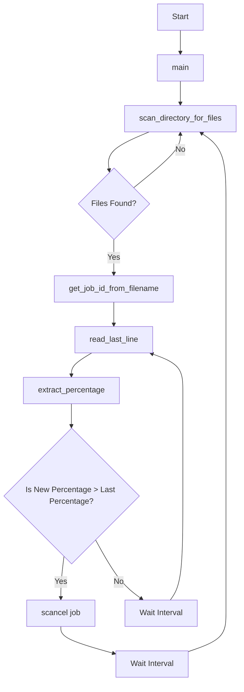

```mermaid
graph TD
    A[Start] --> B[main]
    B --> C[scan_directory_for_files]
    C --> D{Files Found?}
    D -- Yes --> E[get_job_id_from_filename]
    D -- No --> C
    E --> F[read_last_line]
    F --> G[extract_percentage]
    G --> H{Is New Percentage > Last Percentage?}
    H -- Yes --> I[scancel job]
    H -- No --> J[Wait Interval]
    J --> F
    I --> K[Wait Interval]
    K --> C

```

