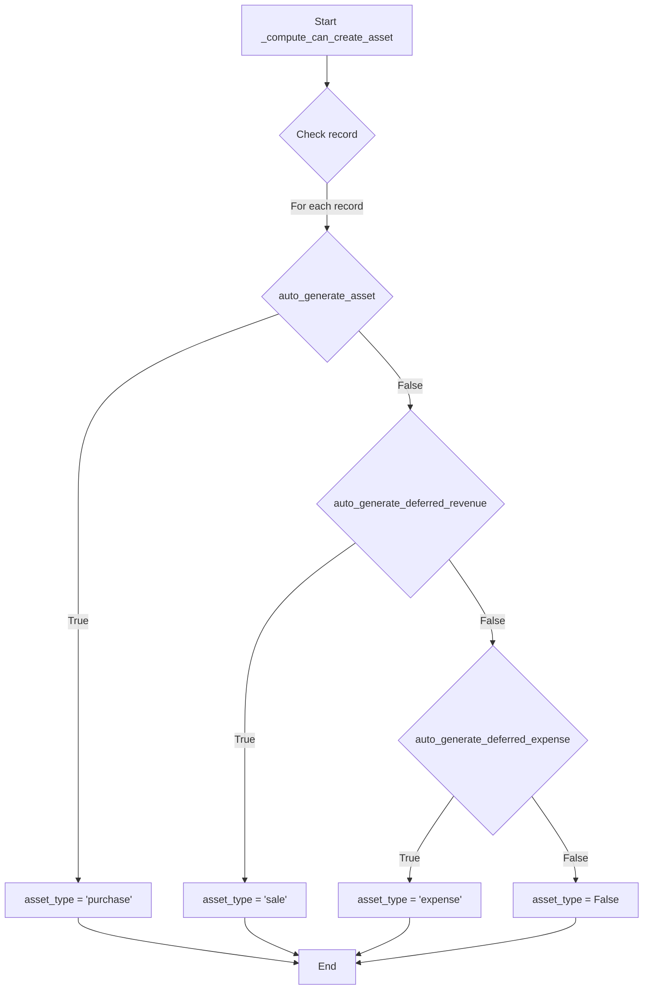
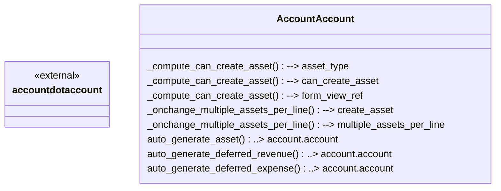
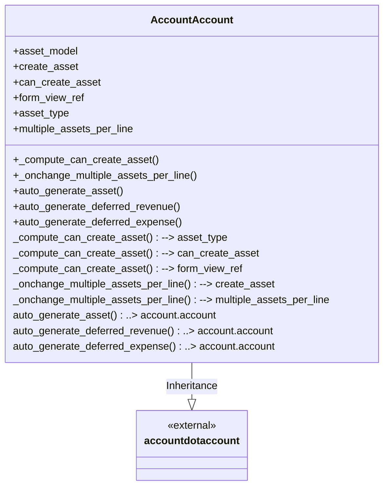
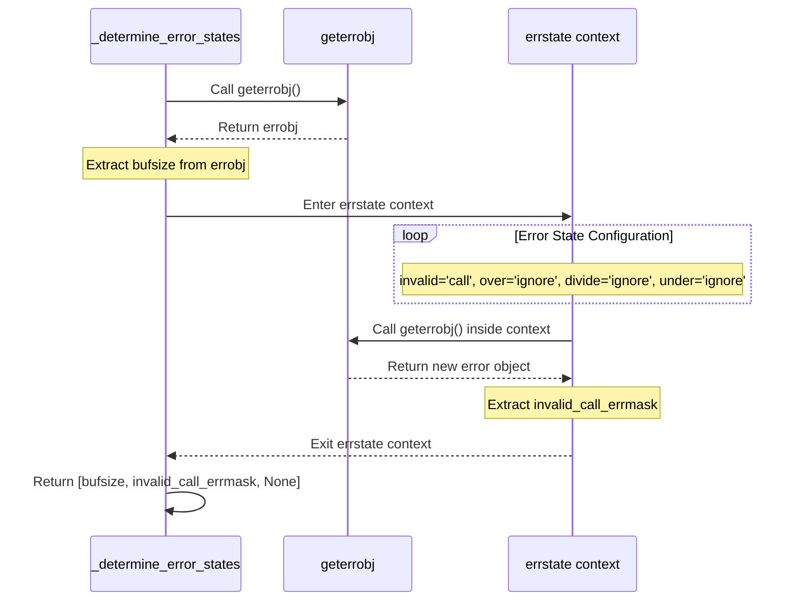
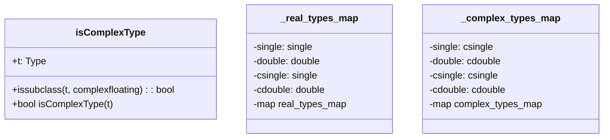
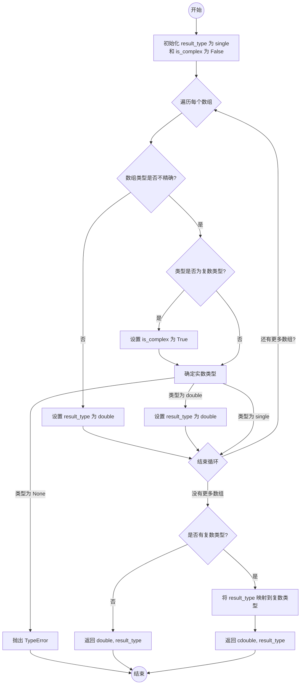

```mermaid
graph TD
    A[Start _compute_can_create_asset] --> B{Check record}
    B -->|For each record| C{auto_generate_asset}
    C -->|True| D[asset_type = 'purchase']
    C -->|False| E{auto_generate_deferred_revenue}
    E -->|True| F[asset_type = 'sale']
    E -->|False| G{auto_generate_deferred_expense}
    G -->|True| H[asset_type = 'expense']
    G -->|False| I[asset_type = False]
    D --> J[End]
    F --> J
    H --> J
    I --> J

```

```mermaid
classDiagram
class accountdotaccount {
      <<external>>
    }

    AccountAccount : _compute_can_create_asset() --> asset_type
    AccountAccount : _compute_can_create_asset() --> can_create_asset
    AccountAccount : _compute_can_create_asset() --> form_view_ref

    AccountAccount : _onchange_multiple_assets_per_line() --> create_asset
    AccountAccount : _onchange_multiple_assets_per_line() --> multiple_assets_per_line

    AccountAccount : auto_generate_asset() ..> account.account
    AccountAccount : auto_generate_deferred_revenue() ..> account.account
    AccountAccount : auto_generate_deferred_expense() ..> account.account

```

```mermaid
classDiagram
    class AccountAccount {
      +asset_model
      +create_asset
      +can_create_asset
      +form_view_ref
      +asset_type
      +multiple_assets_per_line
      +_compute_can_create_asset()
      +_onchange_multiple_assets_per_line()
      +auto_generate_asset()
      +auto_generate_deferred_revenue()
      +auto_generate_deferred_expense()
    }

    AccountAccount --|> accountdotaccount: Inheritance

    class accountdotaccount {
      <<external>>
    }

    AccountAccount : _compute_can_create_asset() --> asset_type
    AccountAccount : _compute_can_create_asset() --> can_create_asset
    AccountAccount : _compute_can_create_asset() --> form_view_ref

    AccountAccount : _onchange_multiple_assets_per_line() --> create_asset
    AccountAccount : _onchange_multiple_assets_per_line() --> multiple_assets_per_line

    AccountAccount : auto_generate_asset() ..> account.account
    AccountAccount : auto_generate_deferred_revenue() ..> account.account
    AccountAccount : auto_generate_deferred_expense() ..> account.account

```

```mermaid
sequenceDiagram
    participant F as _determine_error_states
    participant E as geterrobj
    participant C as errstate context

    F->>E: Call geterrobj()
    E-->>F: Return errobj
    Note over F: Extract bufsize from errobj

    F->>C: Enter errstate context
    loop Error State Configuration
        Note over C: invalid='call', over='ignore', divide='ignore', under='ignore'
    end
    C->>E: Call geterrobj() inside context
    E-->>C: Return new error object
    Note over C: Extract invalid_call_errmask
    C-->>F: Exit errstate context

    F->>F: Return [bufsize, invalid_call_errmask, None]

```

```mermaid
classDiagram
    class isComplexType {
        +t: Type
        +issubclass(t, complexfloating): bool
    }

    class _real_types_map {
        -single: single
        -double: double
        -csingle: single
        -cdouble: double
    }

    class _complex_types_map {
        -single: csingle
        -double: cdouble
        -csingle: csingle
        -cdouble: cdouble
    }

    isComplexType : +bool isComplexType(t)
    _real_types_map : -map real_types_map
    _complex_types_map : -map complex_types_map

```

```mermaid
flowchart TD
    start((开始)) --> init[初始化 result_type 为 single<br>和 is_complex 为 False]
    init --> loop{遍历每个数组}
    loop --> isArrayInexact{数组类型是否不精确?}
    isArrayInexact -- 是 --> isComplexType{类型是否为复数类型?}
    isComplexType -- 是 --> setComplex[设置 is_complex 为 True]
    setComplex --> determineRealType[确定实数类型]
    isComplexType -- 否 --> determineRealType
    isArrayInexact -- 否 --> setDouble[设置 result_type 为 double]
    setDouble --> endLoop{结束循环}
    determineRealType --> |类型为 double| setResultDouble[设置 result_type 为 double]
    setResultDouble --> endLoop
    determineRealType --> |类型为 None| raiseError[抛出 TypeError]
    raiseError --> AMP((结束))
    determineRealType --> |类型为 single| endLoop
    endLoop --> |还有更多数组?| loop
    endLoop --> |没有更多数组| checkIsComplex{是否有复数类型?}
    checkIsComplex -- 是 --> mapToComplex[将 result_type 映射到复数类型]
    checkIsComplex -- 否 --> returnDouble[返回 double, result_type]
    mapToComplex --> returnComplexType[返回 cdouble, result_type]
    returnDouble --> AMP
    returnComplexType --> AMP


```

