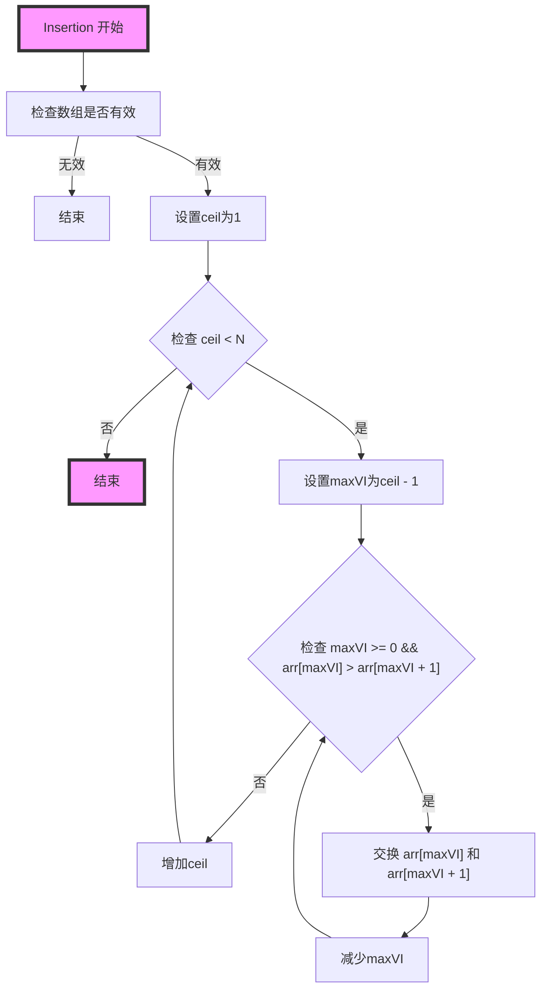
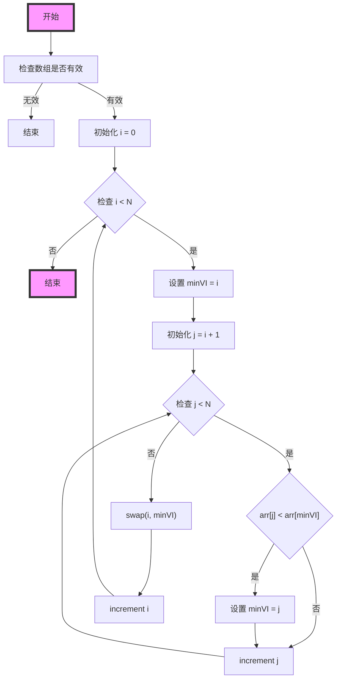
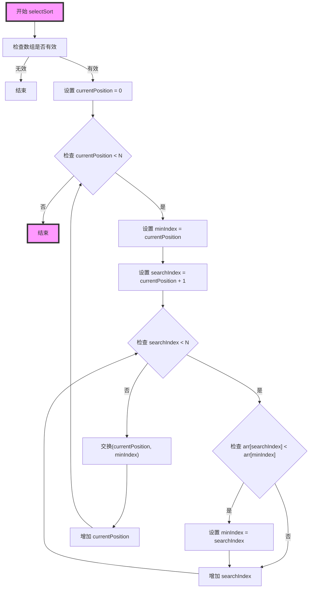
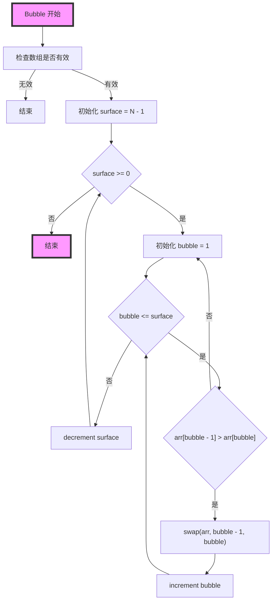
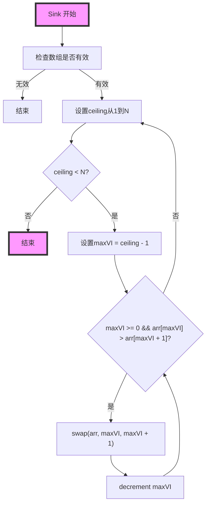
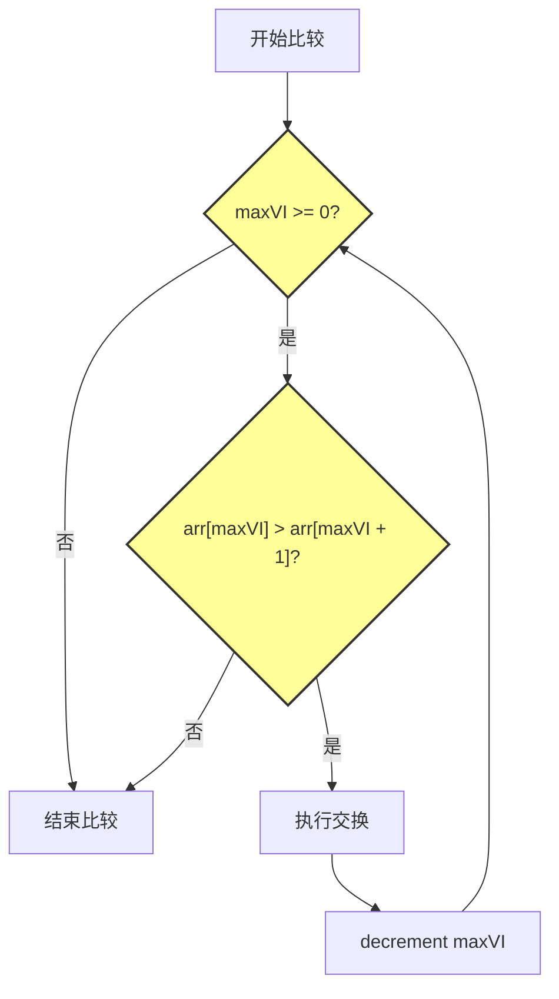

```mermaid
graph TD;
    A[Insertion 开始] --> B[检查数组是否有效];
    B -->|无效| B1[结束];
    B -->|有效| C[设置ceil为1];
    C --> D{检查 ceil < N};
    D -->|否| E[结束];
    D -->|是| F[设置maxVI为ceil - 1];
    F --> G{"检查 maxVI >= 0 && arr[maxVI] > arr[maxVI + 1]"};
    G -->|否| H[增加ceil];
    H --> D;
    G -->|是| I["交换 arr[maxVI] 和 arr[maxVI + 1]"];
    I --> J[减少maxVI];
    J --> G;
    
    classDef startend fill:#f9f,stroke:#333,stroke-width:4px;
    class A,E startend;

```

```mermaid
graph TD;
    A[开始] --> B[检查数组是否有效];
    B -->|无效| B1[结束];
    B -->|有效| C[初始化 i = 0];
    C --> D{检查 i < N};
    D -->|否| E[结束];
    D -->|是| F[设置 minVI = i];
    F --> G[初始化 j = i + 1];
    G --> H{检查 j < N};
    H -->|否| I["swap(i, minVI)"];
    H -->|是| J{"arr[j] < arr[minVI]"};
    J -->|否| K[increment j];
    J -->|是| L[设置 minVI = j];
    L --> K;
    K --> H;
    I --> M[increment i];
    M --> D;
    
    classDef startend fill:#f9f,stroke:#333,stroke-width:4px;
    class A,E startend;

```

```mermaid
graph TD;
    A[开始 selectSort] --> B[检查数组是否有效];
    B -->|无效| B1[结束];
    B -->|有效| C[设置 currentPosition = 0];
    C --> D{检查 currentPosition < N};
    D -->|否| E[结束];
    D -->|是| F[设置 minIndex = currentPosition];
    F --> G[设置 searchIndex = currentPosition + 1];
    G --> H{检查 searchIndex < N};
    H -->|否| I["交换(currentPosition, minIndex)"];
    H -->|是| J{"检查 arr[searchIndex] < arr[minIndex]"};
    J -->|否| K[增加 searchIndex];
    J -->|是| L[设置 minIndex = searchIndex];
    L --> K;
    K --> H;
    I --> M[增加 currentPosition];
    M --> D;
    
    classDef startend fill:#f9f,stroke:#333,stroke-width:4px;
    class A,E startend;

```

```mermaid
graph TD;
    A[Bubble 开始] --> B[检查数组是否有效];
    B -->|无效| B1[结束];
    B -->|有效| C[初始化 surface = N - 1];
    C --> D{surface >= 0};
    D -->|否| E[结束];
    D -->|是| F[初始化 bubble = 1];
    F --> G{bubble <= surface};
    G -->|否| H[decrement surface];
    H --> D;
    G -->|是| I{"arr[bubble - 1] > arr[bubble]"};
    I -->|否| F;
    I -->|是| J["swap(arr, bubble - 1, bubble)"];
    J --> K[increment bubble];
    K --> G;
    
    classDef startend fill:#f9f,stroke:#333,stroke-width:4px;
    class A,E startend;

```

```mermaid
graph TD;
    A[Sink 开始] --> B[检查数组是否有效];
    B -->|无效| B1[结束];
    B -->|有效| C[设置ceiling从1到N];
    C --> D{ceiling < N?};
    D -->|否| E[结束];
    D -->|是| F[设置maxVI = ceiling - 1];
    F --> G{"maxVI >= 0 && arr[maxVI] > arr[maxVI + 1]?"};
    G -->|否| C;
    G -->|是| H["swap(arr, maxVI, maxVI + 1)"];
    H --> I[decrement maxVI];
    I --> G;
    
    classDef startend fill:#f9f,stroke:#333,stroke-width:4px;
    class A,E startend;

```

```mermaid
graph TD;
    A[开始比较] --> B{maxVI >= 0?};
    B -->|否| C[结束比较];
    B -->|是| D{"arr[maxVI] > arr[maxVI + 1]?"};
    D -->|否| C;
    D -->|是| E[执行交换];
    E --> F[decrement maxVI];
    F --> B;
    
    classDef condition fill:#ff9,stroke:#333,stroke-width:2px;
    class B,D condition;

```

