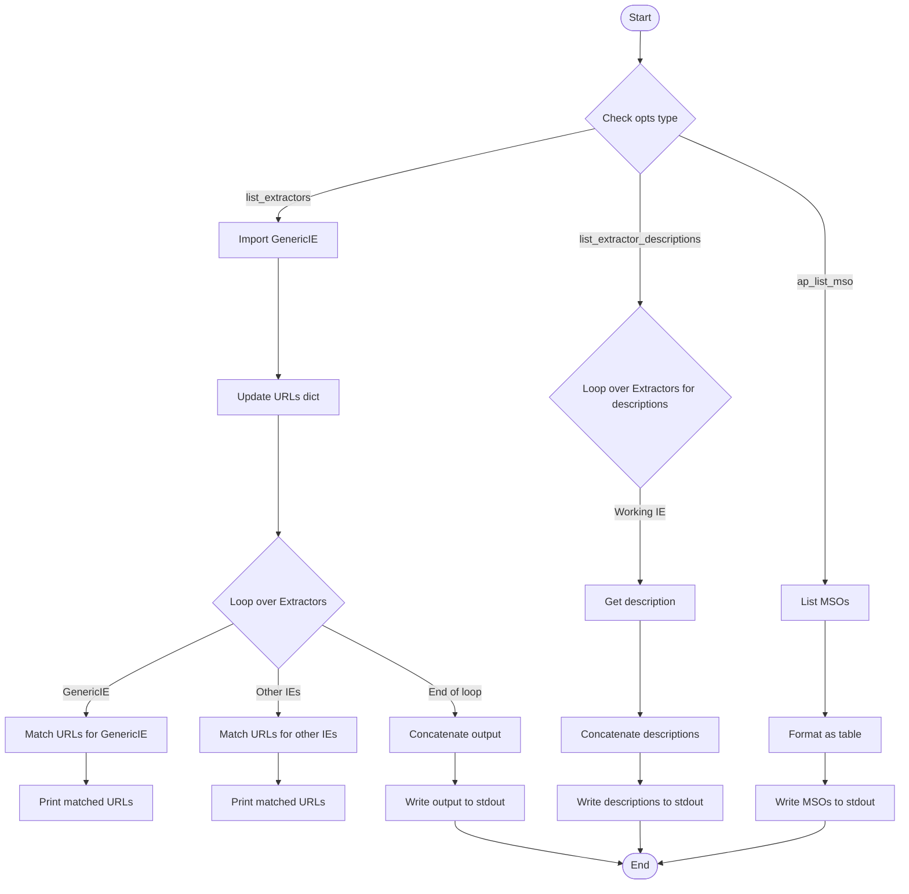
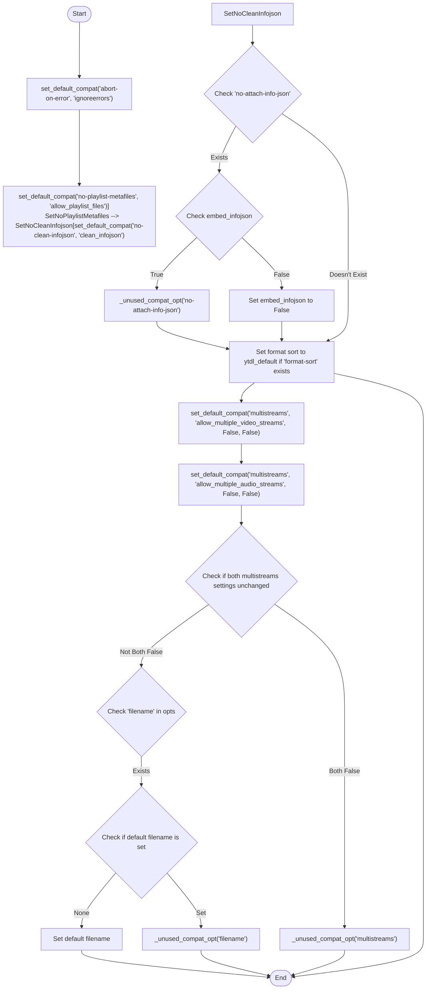

print_extractor_information

Here's a mermaid diagram representing this logic:

```mermaid

flowchart TD
    Start([Start]) --> CheckOpts{Check opts type}
    CheckOpts -->|list_extractors| ImportGeneric[Import GenericIE]
    ImportGeneric --> UpdateUrls[Update URLs dict]
    UpdateUrls --> LoopExtractors{Loop over Extractors}
    LoopExtractors -->|GenericIE| MatchGenericUrls[Match URLs for GenericIE]
    MatchGenericUrls --> PrintUrlsGeneric[Print matched URLs]
    LoopExtractors -->|Other IEs| MatchIEUrls[Match URLs for other IEs]
    MatchIEUrls --> PrintUrlsIE[Print matched URLs]
    LoopExtractors -->|End of loop| ConcatOutputs[Concatenate output]
    ConcatOutputs --> WriteOutput[Write output to stdout]

    CheckOpts -->|list_extractor_descriptions| LoopDesc{Loop over Extractors for descriptions}
    LoopDesc -->|Working IE| GetDescription[Get description]
    GetDescription --> ConcatDesc[Concatenate descriptions]
    ConcatDesc --> WriteDesc[Write descriptions to stdout]

    CheckOpts -->|ap_list_mso| ListMSO[List MSOs]
    ListMSO --> FormatTable[Format as table]
    FormatTable --> WriteMSO[Write MSOs to stdout]

    WriteOutput --> End([End])
    WriteDesc --> End
    WriteMSO --> End
```

You can paste this code into a tool that supports Mermaid (like GitHub, GitLa

```mermaid
flowchart TD
    Start([Start]) --> SetAbortOnError["set_default_compat('abort-on-error', 'ignoreerrors')"]
    SetAbortOnError --> SetNoPlaylistMetafiles["set_default_compat('no-playlist-metafiles', 'allow_playlist_files')]
    SetNoPlaylistMetafiles --> SetNoCleanInfojson[set_default_compat('no-clean-infojson', 'clean_infojson')"]
    SetNoCleanInfojson --> CheckNoAttachInfoJson{Check 'no-attach-info-json'}

    CheckNoAttachInfoJson -->|Exists| CheckEmbedInfoJson{Check embed_infojson}
    CheckEmbedInfoJson -->|True| RemoveNoAttachInfoJson["_unused_compat_opt('no-attach-info-json')"]
    CheckEmbedInfoJson -->|False| SetEmbedInfoJsonFalse[Set embed_infojson to False]
    RemoveNoAttachInfoJson --> SetFormatSort
    SetEmbedInfoJsonFalse --> SetFormatSort[Set format sort to ytdl_default if 'format-sort' exists]
    CheckNoAttachInfoJson -->|Doesn't Exist| SetFormatSort

    SetFormatSort --> SetMultistreamsVideo["set_default_compat('multistreams', 'allow_multiple_video_streams', False, False)"]
    SetMultistreamsVideo --> SetMultistreamsAudio["set_default_compat('multistreams', 'allow_multiple_audio_streams', False, False)"]
    SetMultistreamsAudio --> CheckMultistreamsUnused{Check if both multistreams settings unchanged}

    CheckMultistreamsUnused -->|Both False| RemoveMultistreams["_unused_compat_opt('multistreams')"]
    CheckMultistreamsUnused -->|Not Both False| CheckFilename{Check 'filename' in opts}

    CheckFilename -->|Exists| CheckDefaultFilename{Check if default filename is set}
    CheckDefaultFilename -->|None| SetDefaultFilename[Set default filename]
    CheckDefaultFilename -->|Set| RemoveFilename["_unused_compat_opt('filename')"]
    SetDefaultFilename --> End([End])
    RemoveFilename --> End
    RemoveMultistreams --> End
    SetFormatSort --> End

```

