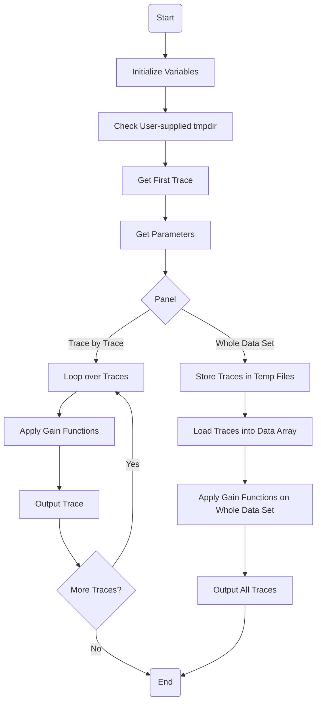

```mermaid
graph TD;
    A(Start) --> B[Initialize Variables];
    B --> C[Check User-supplied tmpdir];
    C --> D[Get First Trace];
    D --> E[Get Parameters];
    E --> F{Panel};
    F -- Trace by Trace --> G[Loop over Traces];
    F -- Whole Data Set --> H[Store Traces in Temp Files];
    G --> I[Apply Gain Functions];
    I --> J[Output Trace];
    J --> K{More Traces?};
    K -- Yes --> G;
    K -- No --> L(End);
    H --> M[Load Traces into Data Array];
    M --> N[Apply Gain Functions on Whole Data Set];
    N --> O[Output All Traces];
    O --> L;

```

